**Rapid Response App**

RR App is designed to provide assistance in emergency situations.

**Features:** 

=> Send emergency messages with your location and emergency type, allowing responders to quickly assess and address the situation.

=> Call emergency numbers according to emergency type, and see nearby locations of hospitals, police stations and more.

=> Add emergency contacts to receive emergency SMS messages.

=> Initiate SOS request with the push of a button.

=> Use Google Maps API, location data and mobile sensors to provide accurate and real-time information to both users and responders.

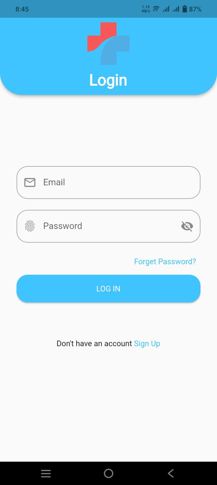 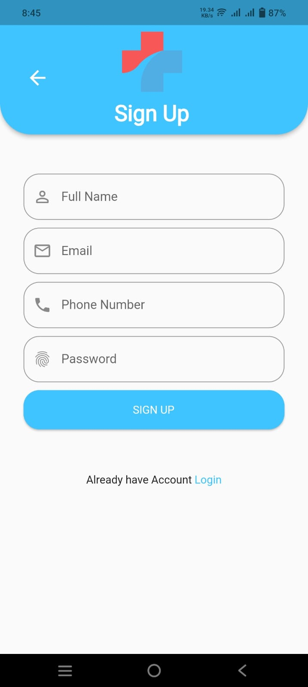

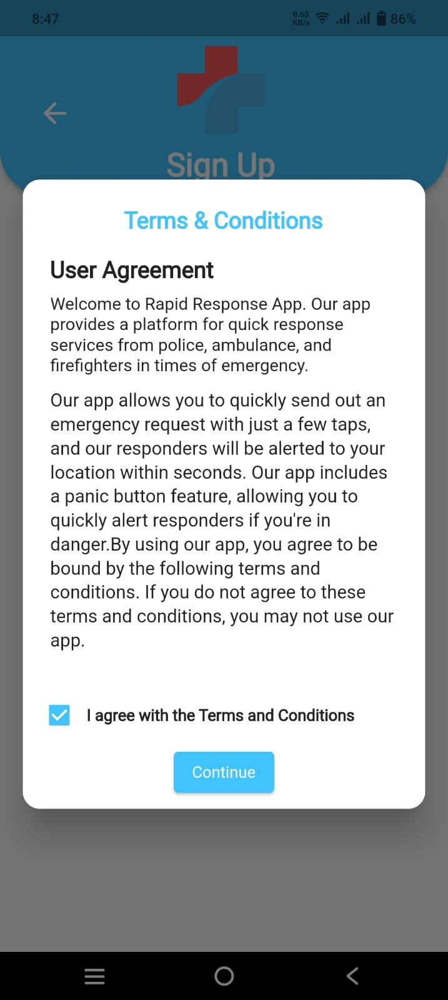 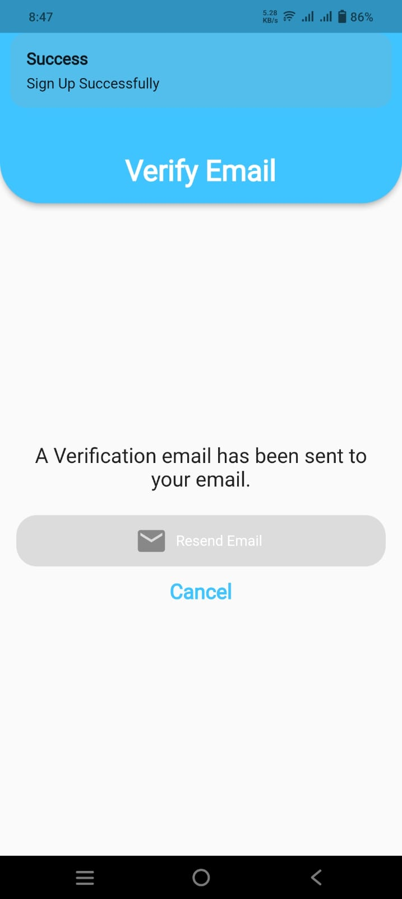

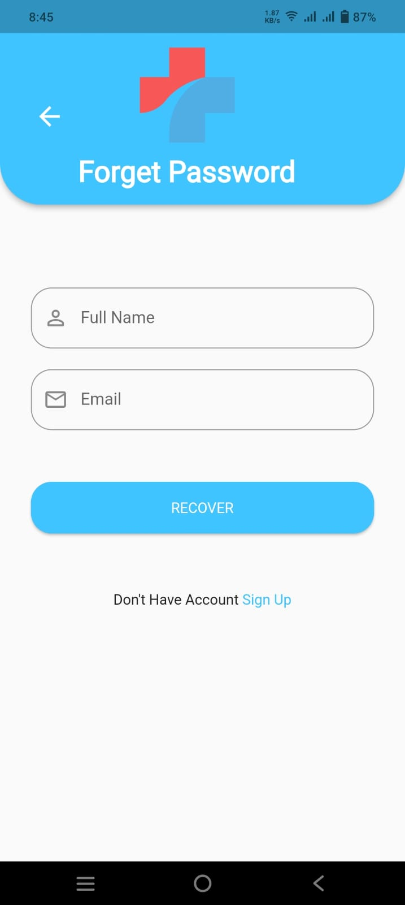 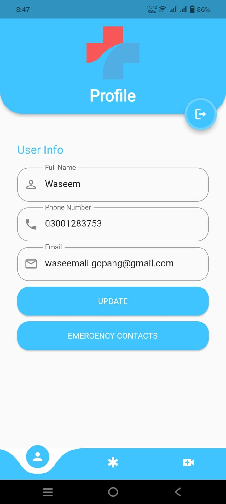

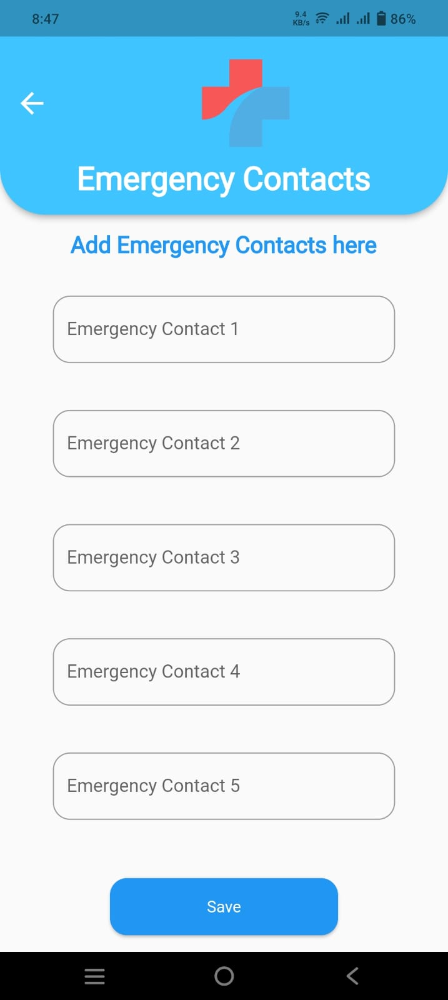 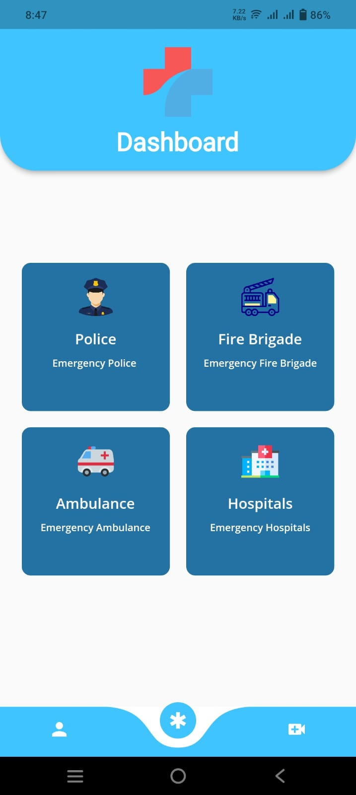

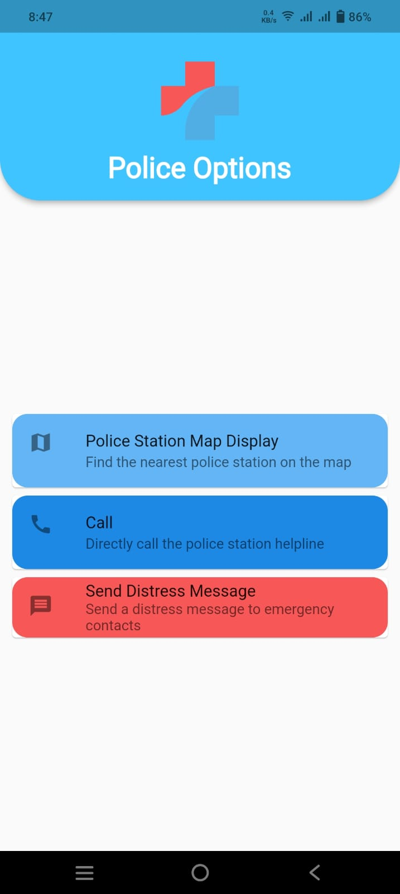 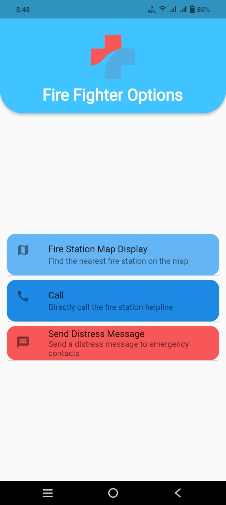

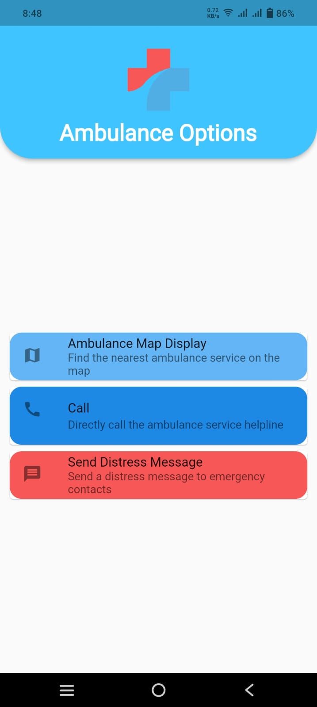 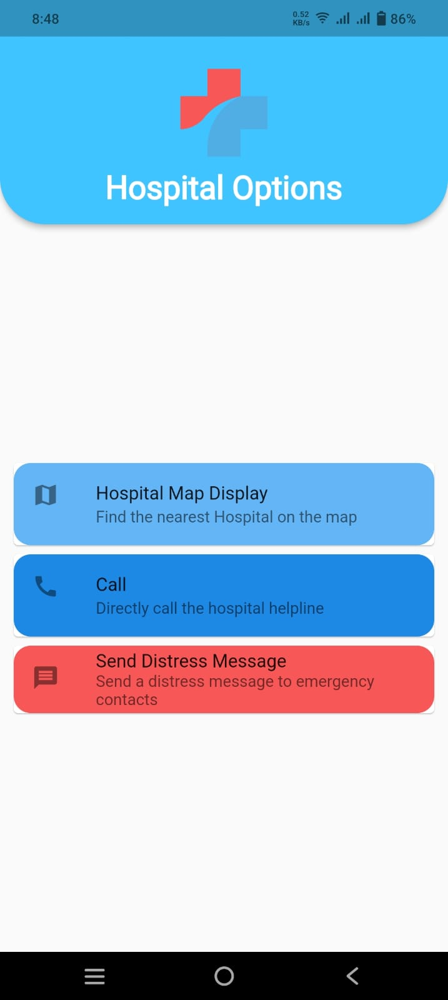

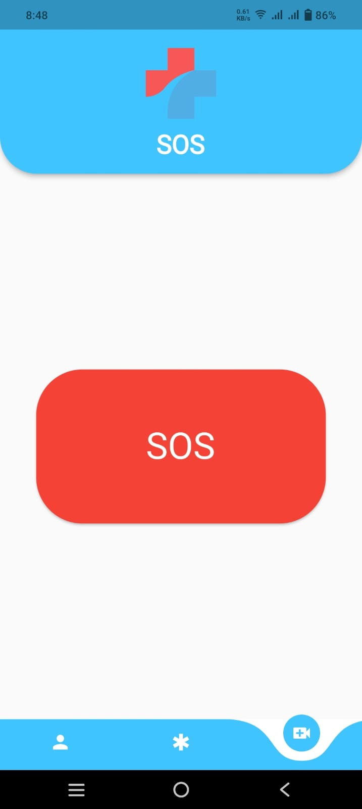 

